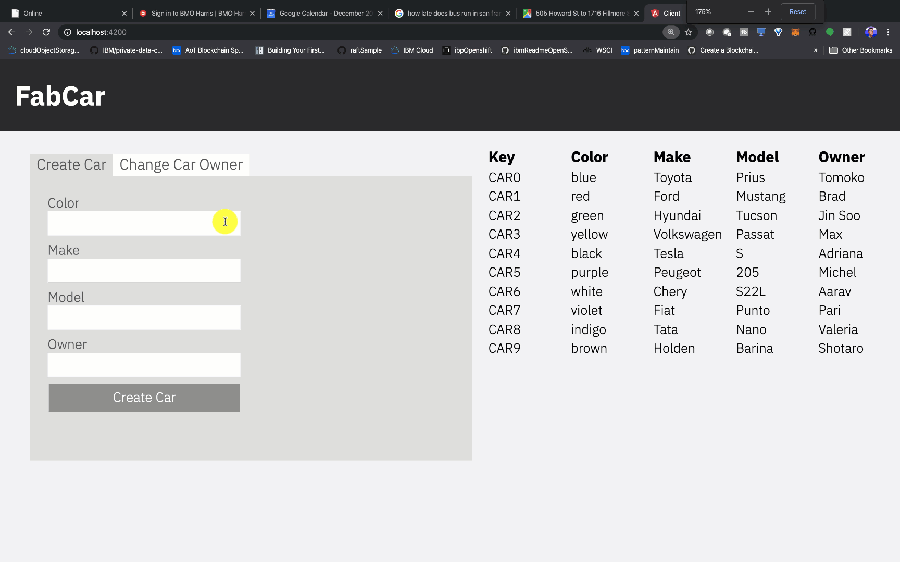

## Building multi-host Hyperledger Fabric network with:

[Hyperledger Fabric v2.2](https://hyperledger-fabric.readthedocs.io/en/release-2.2/whatsnew.html)

[Docker Swarm](https://docs.docker.com/engine/swarm/)

[The Raft Consensus Algorithm](https://raft.github.io/)

## Smart contracts were placed under chaincode/ folder and were written with:

[Golang](https://github.com/IBM/IBMDeveloper-recipes/blob/main/writing-hyperledger-fabric-chaincode-using-go-programming-language/index.md)

## Deploying a Decentralized Application on HLF network with:

[Angular.js](https://angularjs.org/)

[Hyperledger Fabric Client for Node.js](https://hyperledger.github.io/fabric-sdk-node/release-2.2/module-fabric-network.html)

## Displaying container names in required format

`docker ps --format "table{{.ID}}\t{{.Names}}\t{{.Ports}}\t{{.RunningFor}}"`

## Demo 

 

  

 

<!--
## Installation
[Step 1](https://kctheservant.medium.com/multi-host-setup-with-raft-based-ordering-service-29730788b171) 

[Step 2](https://kctheservant.medium.com/multi-host-deployment-for-first-network-hyperledger-fabric-v2-273b794ff3d)
-->

## License
MIT
